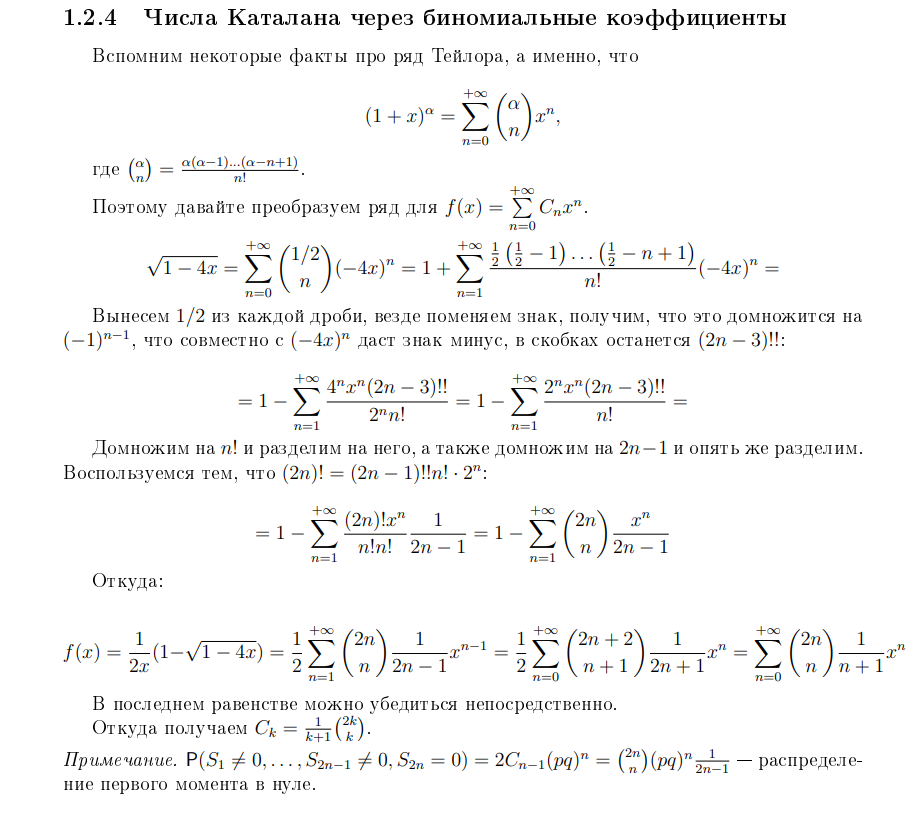

# Тестим мэркдаун

```cpp
int main() {
    return 0;
}
```

```python
if __name__ == "main":
    main()
```

> Это цитата

- [x] Done
- [ ] Not Done :(

Как например HTML                             | И таблички c эмодзи
--------------------------------------------- | -------------------
Оп                                            | :octocat:
<ul><li>[x] item1</li><li>[ ] item2</li></ul> | Оп :+1:

# MARP

$ 2^5 + \frac{1}{2} $


