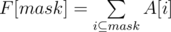
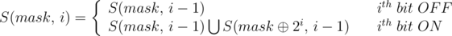

## Немного о том, как хранятся целые числа в этих ваших копутерах

В двоичной системе счисления числа записываются с помощью двух символов (0 и 1). Чтобы не путать, в какой системе счисления записано число, его снабжают указателем справа внизу. Например, число в десятичной системе 5<sub>10</sub>, в двоичной 101<sub>2</sub>. Иногда двоичное число обозначают префиксом 0b, например 0b101.

В двоичной системе счисления (как и в других системах счисления, кроме десятичной) знаки читаются по одному. Например, число 101<sub>2</sub> произносится «один ноль один».

### Натуральные числа

Натуральное число, записываемое в двоичной системе счисления как (a<sub>n-1</sub>a<sub>n-2</sub>... a<sub>1</sub>a<sub>0</sub>)<sub>2</sub>, имеет значение:

<p align="center">
(a<sub>n-1</sub>a<sub>n-2</sub>... a<sub>1</sub>a<sub>0</sub>)<sub>2</sub> = a<sub>0</sub> + 2a<sub>1</sub> + 2<sup>2</sup>a<sub>2</sub> + ... + 2<sup>n-1</sup>a<sub>n-1</sub>
</p>

где:

n — количество цифр (знаков) в числе,

a<sub>k</sub> — значения цифр из множества {0,1},

k — порядковый номер цифры

### А как их хранить?

В компьютерах числа хранятся в двоичной записи. Проще всего хранить натуральные числа: нужно лишь запомнить последовательность из нулей и единиц. К сожалению, мы не можем хранить неограниченно большое число, ниже вы увидите таблицу для ограничений типов в C++:

<table>
   <caption>Таблица ограничений беззнаковых целочисленных типов в C++</caption>
   <tr>
    <th>Тип данных</th>
    <th>Размер, бит</th>
    <th>Ограничения в степенях двойки</th>
    <th>Примерные ограничения</th>
   </tr>
   <tr><td>unsigned char</td><td>8</td><td>[0; 2<sup>8</sup> - 1]</td><td>[0; 255]</td></tr>
   <tr><td>unsigned short</td><td>16</td><td>[0; 2<sup>16</sup> - 1]</td><td>[0; 65'535]</td></tr>
   <tr><td>unsigned int</td><td>32</td><td>[0; 2<sup>8</sup> - 1]</td><td>[0; 4,2 * 10<sup>9</sup>]</td></tr>
   <tr><td>unsigned long long</td><td>64</td><td>[0; 2<sup>64</sup> - 1]</td><td>[0; 1,8 * 10<sup>19</sup>]</td></tr>
</table>

Например, если вы напишете код

```cpp
unsigned char x = 11;
```

То в памяти 11 будет храниться как ```00001011```.

### Отрицательные целые числа

Первая идея, которая приходит в голову - это зарезервировать один бит под знак (например, старший). Такой подход называется "прямой код", и при его использовании возникнет сразу две проблемы:

1. Числа ```00000000``` и ```10000000``` обозначают 0 и -0. То есть есть два обозначение одного и того же числа 0.
2. Другая проблема - это арифметические операции. Оказывается, их очень неудобно реализовывать, если старший бит будет отвечать за знак.

Но есть и несколько плюсов:

1. Достоинства представления чисел с помощью кода с дополнением до единицы
2. Простое получение кода отрицательных чисел.
3. Из-за того, что 0 обозначает +, коды положительных чисел относительно беззнакового кодирования остаются неизменными.
Количество положительных чисел равно количеству отрицательных.

Всё же оказывается, что данный подход не применим для архитектуры компьютера, поэтому люди придумали решение, именуемое "дополнительный код":

Будем хранить "остатки" от деления на 2<sup>8</sup> (или нужную степень двойки). Таким образом, если мы хотим сохранить число x от 0 до 127, то мы будем хранить именно его. Для чисел x из интервала [-128; -1] будем хранить его остаток от деления на 256, что эквивалентно числу 256 + x.
Таким образом мы решили сразу две проблемы (вторая проблема решена, автоматически, так как арифметика остатков очень простая).

Таким образом, если вы напишете

```cpp
char x = -2;
```

То в x будет записан в памяти как 256 - 2 = 254: ```11111110```

Преимущества данного подхода:

1. Возможность заменить арифметическую операцию вычитания операцией сложения и сделать операции сложения одинаковыми для знаковых и беззнаковых типов данных, что существенно упрощает архитектуру процессора и увеличивает его быстродействие.
2. Нет проблемы двух нулей.

Недостатки:

1. Ряд положительных и отрицательных чисел несимметричен, но это не так важно: с помощью дополнительного кода выполнены гораздо более важные вещи, желаемые от способа представления целых чисел.
2. В отличие от сложения, числа в дополнительном коде нельзя сравнивать как беззнаковые, или вычитать без расширения разрядности.

<table>
   <caption>Таблица ограничений знаковых целочисленных типов в C++</caption>
   <tr>
    <th>Тип данных</th>
    <th>Размер, бит</th>
    <th>Ограничения в степенях двойки</th>
    <th>Примерные ограничения</th>
   </tr>
   <tr><td>char</td><td>8</td><td>[-2<sup>7</sup>; 2<sup>7</sup> - 1]</td><td>[-128; 127]</td></tr>
   <tr><td>short</td><td>16</td><td>[-2<sup>15</sup>; 2<sup>15</sup> - 1]</td><td>[-32768; 32767]</td></tr>
   <tr><td>int</td><td>32</td><td>[-2<sup>31</sup>; 2<sup>31</sup> - 1]</td><td>[-2,1 * 10<sup>9</sup>; 2,1 * 10<sup>9</sup>]</td></tr>
   <tr><td>long long</td><td>64</td><td>[-2<sup>63</sup>; 2<sup>63</sup> - 1]</td><td>[-9 * 10<sup>18</sup>; 9 * 10<sup>18</sup>]</td></tr>
</table>

Обратите внимаение, здесь в таблице нет типа ```long```. Он равен обычному ```int``` и его никогда не стоит использовать!

## Упражнения на битовые операции

Теперь вы формально знаете, как хранятся числа в двоичной записи. Настало время этим воспользоваться.

### Битовые операции в C++

Есть несколько видов битовых операций: логические или, и, ксор и отрицание. Они выполняют логические операции над каждым битом независимо. На C++ это будет соответственно так:

```cpp
char a = 0b0011; // 3
char b = 0b0101; // 5
char c = a | b; // 0011 | 0101 = 0111 = 7
char d = a & b; // 0011 & 0101 = 0001 = 1
char e = a ^ b; // 0011 ^ 0101 = 0110 = 6
char g = ~a; // ~00000011 = 11111100 = -4
```

Кроме того, часто пригождается еще и операции битового сдвига влево и вправо соответственно:

```cpp
char h = a << 2; // 11 << 2 = 1100 = 12
char i = b >> 2; // 101 >> 2 = 1
```

С помощью таких примитивов предлагается решить несколько упражнений:

> Как получить 2<sup>n</sup>?

<details markdown="1">
<summary>Решение</summary>

```cpp
int x = 1 << n;
long long y = 1LL << n;
```
</details>

> Как убрать последнюю единицу в битовой записи?

<details markdown="1">
<summary>Решение</summary>

```cpp
int x = 228;
int y = x & (x - 1); // x без последней единицы в битовой записи
```
</details>

> Как убрать группу из единиц на конце числа?

```cpp
int x = 7 + 32;
int y = x & (x + 1); // x без группы из единиц на конце числа, т.е. 32
```

## ДП по подмножествам

> Задача коммивояжера. Во взвешенном графе необходимо проложить маршрут кратчайшей длины, посещающий все вершины, при том каждую только один раз.

<details markdown="1">

<summary>Решение</summary>

Пусть dp[mask][v] - это кратчайший путь, посещающий все вершины из mask и заканчивающийся в вершине v. Mask (маска) - это последовательность из n нулей и единиц. Здесь и далее мы будем говорить, что вершина лежит в маске, если на её позиции стоит единица.

Переходы в динамике вполне очевидны: dp[mask][v] -> dp[mask + u-тая вершина][u] + adj[v][u], где adj[v][u] - вес ребра между вершинами v и y. Или, на C++, так:

```cpp
new_mask = mask | (1 << u);
dp[new_mask][u] = min(dp[new_mask][u], dp[mask][v] + adj[v][u])
```

Таким образом мы найдем ответ за время O(2<sup>n</sup> n <sup>2</sup>), так как в динамике 2<sup>n</sup> n состояний и из каждой n переходов.

</details>

<details markdown="1">

<summary>Код</summary>

```cpp
#include <iostream>
#include <vector>
#include <algorithm>
#include <fstream>
#include <random>
#include <queue>
#include <cstring>

using namespace std;

const int N = 19;
int a[N][N];
int dp[(1 << N)][N];
const int INF = 2e9;

signed main() {
    cin.tie(0);
    ios_base::sync_with_stdio(0);

    int n;
    cin >> n;

    for (int i = 0; i < n; ++i) {
        for (int j = 0; j < n; ++j) {
            cin >> a[i][j];
        }
    }

    int P = 1 << n;

    for (int mask = 0; mask < P; ++mask) {
        for (int i = 0; i < n; ++i) {
            dp[mask][i] = INF;
        }
    }
    for (int i = 0; i < n; ++i) {
        dp[1 << i][i] = 0;
    }

    for (int mask = 0; mask < P; ++mask) {
        for (int i = 0; i < n; ++i) { // последняя вершина в пути
            for (int j = 0; j < n; ++j) {
                if (((mask >> i) & 1) && ((mask >> j) & 1) == 0) {
                    dp[mask | (1 << j)][j] = min(dp[mask | (1 << j)][j], dp[mask][i] + a[i][j]);
                }
            }
        }
    }

    int best_end = 0;
    for (int i = 0; i < n; ++i) {
        if (dp[P - 1][i] < dp[P - 1][best_end]) {
            best_end = i;
        }
    }

    cout << dp[P - 1][best_end] << '\n';
    vector<int> ans;
    int mask = P - 1;
    for (int i = 0; i < n; ++i) {
        ans.push_back(best_end);
        int old_mask = mask ^ (1 << best_end);
        for (int j = 0; j < n; ++j) {
            if (dp[old_mask][j] + a[j][best_end] == dp[mask][best_end]) {
                best_end = j;
                break;
            }
        }
        mask = old_mask;
    }
    for (int i = n - 1; i >= 0; --i) {
        cout << ans[i] + 1 << ' ';
    }
}
```

</details>

## SOS dp

Sum over Subsets (SOS) dp - это техника, позволяющая найти сумму следующего вида:

<p align="center"></p>

То есть для каждой маски найти сумму элементов на всех её подмасках.

### Перебор всех подмасок данной маски

Сразу продемонстрируем способ:

```cpp
for (int submask = mask; s; submask = (submask - 1) & mask)
    F[mask] += A[submask]
```

Ок, почему это работает?

Пусть у нас есть текущая подмаска submask, и мы хотим перейти к следующей подмаске. Отнимем от маски submask единицу, тем самым мы снимем самый правый единичный бит, а все биты правее него поставятся в 1. Затем удалим все "лишние" единичные биты, которые не входят в маску mask и потому не могут входить в подмаску. Удаление осуществляется битовой операцией & mask. В результате мы "обрежем" маску submask-1 до того наибольшего значения, которое она может принять, т.е. до следующей подмаски после submask в порядке убывания.

Таким образом, этот алгоритм генерирует все подмаски данной маски в порядке строгого убывания, затрачивая на каждый переход по две элементарные операции.

При этом для каждой маски перебрать все её подмаски займет по времени O(3<sup>n</sup>). Почему? Приведем комбинаторное доказательство:

Каждый бит независимо может быть в одном из трех состояний: не в маске, в маске И подмаске одновременно или в маске, но не в подмаске, значит всего таких состояний 3<sup>n</sup> (потому что биты независимы), что и т.д.

### SOS DP

Введём вспомогательное состояние, которое позволит считать сумму более эффективно. Пусть dp[mask][k] - это сумма на всех подмасках, которые отличаются от mask только в последних k битах (в 0-индексации). Например, если mask=10101<sub>2</sub>, то dp[mask][3] будет отвечать за 4 подмаски: 10000<sub>2</sub>, 10001<sub>2</sub>, 10100<sub>2</sub> и 10101<sub>2</sub>.

После того, как мы придумали состояние, придумать переходы не составляет труда: если на позиции k стоит 0, то и в подмасках на этой позиции должен стоять 0, т.е. переход в dp[mask][k-1], если же на позиции k стоит 1, то в подмасках может стоять как 0, так и 1. Т.е. мы можем либо занулить этот бит, либо оставить единичным: dp[mask ^ (1 << k)][k-1] + dp[mask][k-1].

<p align="center"></p>

```cpp
for (int mask = 0; mask < (1 << N); ++mask) {
    dp[mask][-1] = A[mask];
    for (int i = 0; i < N; ++i) {
        if (mask & (1 << i))
            dp[mask][i] = dp[mask][i - 1] + dp[mask ^ (1 << i)][i - 1];
        else
            dp[mask][i] = dp[mask][i - 1];
    }
    F[mask] = dp[mask][N - 1];
}
```

Можно заметить, что переходы по второй размерности ведут только в прошлый слой, а потому можно отказаться от неё:

```cpp
for (int i = 0; i < (1 << N); ++i)
    F[i] = A[i];
for (int i = 0; i < N; ++i)
    for (int mask = 0; mask < (1 << N); ++mask) {
        if (mask & (1 << i))
            F[mask] += F[mask ^ (1 << i)];
}
```

## Ссылки

1. [Как хранятся целые числа](https://neerc.ifmo.ru/wiki/index.php?title=%D0%9F%D1%80%D0%B5%D0%B4%D1%81%D1%82%D0%B0%D0%B2%D0%BB%D0%B5%D0%BD%D0%B8%D0%B5_%D1%86%D0%B5%D0%BB%D1%8B%D1%85_%D1%87%D0%B8%D1%81%D0%B5%D0%BB:_%D0%BF%D1%80%D1%8F%D0%BC%D0%BE%D0%B9_%D0%BA%D0%BE%D0%B4,_%D0%BA%D0%BE%D0%B4_%D1%81%D0%BE_%D1%81%D0%B4%D0%B2%D0%B8%D0%B3%D0%BE%D0%BC,_%D0%B4%D0%BE%D0%BF%D0%BE%D0%BB%D0%BD%D0%B8%D1%82%D0%B5%D0%BB%D1%8C%D0%BD%D1%8B%D0%B9_%D0%BA%D0%BE%D0%B4)
1. [Большой пост с разбором восьми задач на ДП по подмножествам с кучей трюков](https://codeforces.com/blog/entry/337)
1. [English SOS dp tutorial с задачами на тему](https://codeforces.com/blog/entry/45223)
1. [Перебор всех подмасок данной маски](http://e-maxx.ru/algo/all_submasks)
