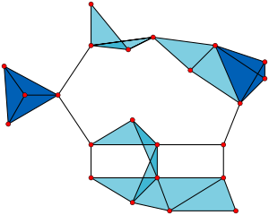

## Четверка с суммой ноль

> В массиве размера $n$ ($n \leq 2000$) необходимо найти четыре числа, сумма которых равна $0$ (числа могут быть использованы несколько раз).

<details markdown="1" style="margin-bottom: 5%"><summary>Решение</summary>

Четыре числа $a, b, c, d$ с суммой $0$ прекрасно деляется на две части: $a+b = -(c+d)$. То есть если мы зафиксировали сумму первых двух чисел, то мы знаем, какой должна быть сумма вторых двух чисел. Это позволяет решить задачу за $O(n^2 \log n)$:

1. Сохраним суммы всех пар во множестве за $O(n^2 \log n)$
2. Переберем все пары ещё раз и проверим, есть ли пара чисел с противоположной суммой. Этот шаг тоже работает за $O(n^2 \log n)$

</details>

## Количество возрастающих подпоследовательностей длины 3

> Дана последовательность $a_1, a_2, \ldots, a_n$. Найдите количество возрастающих подпоследовательностей длины $3$.

<details markdown="1" style="margin-bottom: 5%"><summary>Решение для $n \leq 2000$</summary>
Будем перебирать центральный элемент в последовательности. Тогда пусть центральный элемент равен $a_i$, сколько последовательностей с таким элементов в середине есть? То есть нужно найти количество пар $(j, k)$: $j < i < k$ и $a_j < a_i \leq a_k$. Но по сути задачи для $j$ и $k$ не зависят друг от друга, поэтому можно независимо перебрать количество подходящих $j$ и $k$ суммарно за $O(n)$.
</details>

**Бонус**: решите задачу при ограничениях $n \leq 10^5$.

Часто техника *meet-in-the-middle* (дословно, «встреча в середине») применяется и в задачах с полным перебором. Рассмотрим какую-нибудь задачу на перебор подмножеств, которую мы умеем решать за $O(2^n \cdot poly(n))$, где $poly(n)$ — какой-то полином от размера задачи $n$. Метод meet-in-the-middle позволяет соптимизировать перебор до $O(2^{n/2} \cdot poly(n))$ в большом классе таких задач.

## Задача о рюкзаке

> Рассмотрим задачу о рюкзаке — нужно выбрать подмножество $a_i$ с суммарным весом $w$, однако в нашей задаче веса предметов могут быть большими: $1 \leq a_i \leq 10^9$.

<details markdown="1" style="margin-bottom: 5%"><summary>Решение для $n \leq 25$</summary>
Тогда перебор всех подмножеств можно осуществить следующим образом:

```cpp
bool find_subset(int *a, int n, int w)
    for (int mask = 0; mask < (1 << n); mask++) {
        int s = 0;
        for (int i = 0; i < n; i++)
            if (mask >> i & 1)
                s += a[i];
        if (s == w)
            return true;
    }
    return false;
}
```

Здесь мы перебираем все подмножества и каждое проверяем за $O(n)$, что дает асимптотику $O(2^n \cdot n)$.

В теории можно избавиться от проверки за $O(n)$, если перебирать маску рекурсивно и поддерживать текущую сумму на префиксе, возможно добавляя во время спуска только один элемент. Однако мы погонимся за более мощной оптимизацией.
</details>

<details markdown="1" style="margin-bottom: 5%"><summary>Решение для $n \leq 50$</summary>

Разделим массив на две части. Заметим, что искомое подмножество имеет какое-то количество элементов из левой половины и какое-то количество элементов из правой (возможно, нулевое). Попытаемся посчитать все суммы слева и справа по отдельности и найти пару, дающую нужную общую сумму.

Сначала посчитаем суммы для всех подмножеств среди первых $l = \lfloor \frac{n}{2} \rfloor$ элементов и положим в хеш-таблицу:

```cpp
unordered_set<int> t;

int l = n / 2;

for (int mask = 0; mask < (1 << l); mask++) {
    int s = 0;
    for (int i = 0; i < n; i++)
        if (mask >> i & 1)
            s += a[i];
    t.insert(s);
}
```

Затем переберем все суммы среди оставшихся $r = n - l = \lceil \frac{n}{2} \rceil$ элементов и для каждой попытаемся найти подходящую половину (с суммой $s_l = w - s_r$) через предподсчитанную хеш-таблицу:

```cpp
int r = n - l;

for (int mask = 0; mask < (1 << r); mask++) {
    int s = 0;
    for (int i = 0; i < r; i++)
        if (mask >> i & 1)
            s += a[l + i];
    if (t.count(w - s))
        return true;
}
```

Обе фазы (а значит и сам алгоритм) работают за $O(2^{n/2} \cdot n)$: мы перебираем $2^{n/2}$ подмножеств и для каждого за $O(n)$ считаем сумму и делаем запрос добавления / проверки наличия в хеш-таблицу за $O(1)$.

Заметим, что оба перебора всё ещё можно так же соптимизировать в $O(n)$ раз через трюк с рекурсией.

</details>

## Модификации рюкзака

> Можно ли разделить предметы на четыре кучки равного веса за $O(n2^n)$?

> Можно ли разделить предметы на $k$ кучек равного веса за $O(n2^n)$?

## Количество клик

> Дан граф из $n$ $(n \leq 40)$ вершин. Нужно найти количество *клик* — подграфов, в котором все вершины связаны со всеми.



<details markdown="1" style="margin-bottom: 5%"><summary>Решение</summary>

Сначала научимся решать задачу полным перебором. Пусть у нас есть матрица смежности графа. Как быстро проверить, что подмножество вершин $m$ является кликой?

За $O(n^2)$ можно пройтись по всем парам включенных вершин и для каждой проверить, есть ли единичка в матрице смежности. Проверку можно соптимизировать до $O(n)$, посчитав маску $m'$, равную побитовому «И» строчек матрицы смежности, соответствующих вершинам $m$. Теперь, если $m$ является подмножеством $m'$, то есть

$$
m \; \& \; m' = m
$$

то подграф $m$ является кликой: для всех его вершин есть ребро из всех других.

Воспользуемся этим трюком для слияния ответов в meet-in-the-middle. Разделим граф на две части, найдем для левой все клики и пометим их маски единицами в специальном массиве `is_clique[mask]` размера $2^{n/2}$.

Теперь будем перебирать подграфы второй половины, и для каждой клики нам нужно найти количество клик левой половины, являющихся подграфами пересечения списков смежности для правой половины ($m'$ из проверки выше).

Чтобы сделать это быстро, предподсчитаем поверх массива `is_clique` динамику «как много подмасок данной маски являются кликами». Эту динамику можно посчитать за $O(2^{n/2})$, если для каждой маски $m$ рассмотреть два варианта — когда первая вершина $v$ включена в клику и когда не включена:

$$
f[m] = f[m \; \& \; g_v \oplus 2^v] + f[m \oplus 2^v] + is\_clique[m]
$$

Итоговая асимптотика алгоритма будет $O(2^{n/2} \cdot n)$.
</details>

## Взломай хеш

> Найдите строку $s$ из строчных латинских букв с полиномиальным хешом, равным $X$, где основание хеша равно $26$, а модуль $M$ ($M \leq 10^9$). Напомним, что полиномиальных хеш вычисляется по формуле:
> $$ h(s_1s_2\ldots s_n) = (s_1 + 26 \cdot s_2 + 26^2 \cdot s_3 + \ldots + 26^{n-1}\cdot s_n) \% M $$

<details markdown="1" style="margin-bottom: 5%"><summary>Решение</summary>
Соберем случайные $10^6$ строк небольшой длины. Все их хеши - случайные числа. Конечно, вероятность попасть так в нужный хеш размера $10^9$ стремится к нулю, поэтому трюк:

Искомая строка будет иметь вид $t_i + t_j$, где $t_i, t_j$ из нашего множества строк. И вот теперь то мы уже с вероятностью 1 соберем нужных хеш. Почему? Потому что пар $t_i+t_j$ порядка $10^12$, то есть количество строк увеличилось в квадрат раз. А вероятность того, что мы не попали этими $10^12$ строками в нужный $X$ стремится к нулю.

Такое решение работает за $O(10^6 \log 10^6)$, потому что если зафиксировать $t_i$, то мы знаем, чем должен быть равен хеш $t_j$, то есть явно перебирать все пары нам не надо - надо лишь проверить наличие строки с заданным хешом во множестве.
</details>

## Подпоследовательсность с максимальной суммой по модулю

> Дана последовательность $a_1, a_2, \ldots, a_n$ ($n \leq 40$) целых неотрицательных чисел. Необходим выбрать такую подпоследовательность $a_{i_1}, a_{i_2}, \ldots, a_{i_k}$, что сумма $(a_{i_1} + a_{i_2} + \ldots + a_{i_k}) \% M$ ($M \leq 10^9$)максимальна.

<details markdown="1" style="margin-bottom: 5%"><summary>Решение</summary>
Разобьём последовательность на две части по $\frac{n}{2}$ элементов. В каждой из них вычислим суммы всех возможных подпоследовательностей за $O(2^n)$. Для каждой возможной суммы $x$ из первой половины найдем оптимальное подмножество с суммой $y$ из второй половины так, чтобы $(x+y)\%m$ было как можно больше. Есть два случая:

1. $x + y < m$, тогда нас интересует максимальный $y: y < m - x$. Такой $y$ можно найти в во множестве за $\log$ размера множества, то есть за $O(n)$.
2. $x + y \geq m$, тогда нас просто интересует максимальный $y$ без каких-либо ограничений

То есть итоговое решение работает за $O(2^{\frac{n}{2}}n)$ и в нём для каждого $x$ мы ищем лучшее $y$.
</details>

<details markdown="1" style="margin-bottom: 5%"><summary>Код</summary>

```cpp
#include <iostream>
#include <vector>
#include <cassert>
#include <set>

using namespace std;

int m;
int a[40];

void rec(int s, int i, int n, vector<int>& ans) {
    if (i == n) {
        ans.push_back(s);
        return;
    }
    rec(s, i + 1, n, ans);
    rec((s + a[i]) % m, i + 1, n, ans);
}

int main() {
    int n;
    cin >> n >> m;
    for (int i = 0; i < n; ++i) {
        cin >> a[i];
    }

    vector<int> left, right;
    rec(0, 0, n / 2, left);
    rec(0, n / 2, n, right);

    set<int> lefts(left.begin(), left.end());

    int best_ans = 0;

    for (int x : right) {
        best_ans = max(best_ans, (*left.rbegin() + x) % m);
        // y: y < m - x, y -> max
        auto it = lefts.lower_bound(m - x);
        if (it != lefts.begin()) {
            best_ans = max(best_ans, x + *prev(it));
        }
    }

    cout << best_ans;

    return 0;
}
```

</details>

## Сделай их похожими

> Назовем два числа похожими, если в их двоичных представлениях одинаковое количество единиц. Вам задан массив из $n$ ($n \leq 100$) целых чисел $a_1, a_2, \ldots, a_n$ ($a_i \leq 10^9$). Вы должны выбрать неотрицательное целое число $x$, после чего вы получите новый массив из $n$ чисел $b_1, b_2, \ldots, b_n$, где $b_i = a_i \oplus x$. Можно ли получить такой массив $b$, в котором все числа похожи друг на друга?

<details markdown="1" style="margin-bottom: 5%"><summary>Решение</summary>

Если бы $a_i \leq 2^{15}$, то можно было бы перебрать все $x$ и в лоб проверить. Но $a_i$ большие, исправим это: разобьем $a_i$ на две части: $a_i = p_i + 2^{15} \cdot q_i$, где $p_i, q_i \leq 2^15$. Пусть так же $x = x_p + 2^{15} x_q$

Если я зафиксирую $x_p$, то какие ограничения можно наложить на $x_q$? Для всех $i$ должно выполняться:

$$ cnt_1(p_1 \oplus x_p) + cnt_1(q_1 \oplus x_q) = cnt_1(p_i \oplus x_p) + cnt_1(q_i \oplus x_q) $$

Перенесём всё что с $x_q$ в одну часть, всё что с $x_p$ - в другую:

$$ cnt_1(p_i \oplus x_p) - cnt_1(p_1 \oplus x_p) = cnt_1(q_i \oplus x_q) - cnt_1(q_1 \oplus x_q) $$

Таким образом мы можем вычислить вектор из значений $cnt_1(p_i \oplus x_p) - cnt_1(p_1 \oplus x_p)$ и искать подходящий вектор из такого же вида из $q$ (во множестве). Таким образом асимптотика $O(A_{\max} \cdot n \cdot \log (A_{\max}))$
</details>

## Ссылки

1. [neerc](https://neerc.ifmo.ru/wiki/index.php?title=Meet-in-the-middle)
1. [algorithmica](https://ru.algorithmica.org/cs/decomposition/mitm/)
1. [cf Errichto blog](https://codeforces.com/blog/entry/95571)
