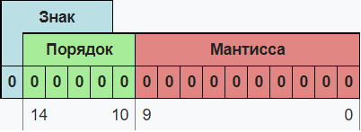
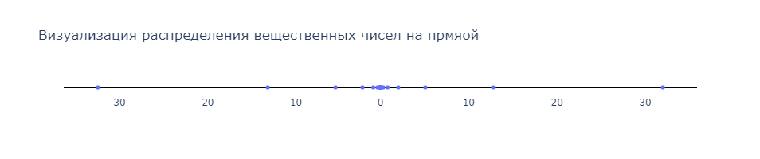

## Двоичная запись числа [wiki](https://neerc.ifmo.ru/wiki/index.php?title=%D0%9F%D1%80%D0%B5%D0%B4%D1%81%D1%82%D0%B0%D0%B2%D0%BB%D0%B5%D0%BD%D0%B8%D0%B5_%D1%86%D0%B5%D0%BB%D1%8B%D1%85_%D1%87%D0%B8%D1%81%D0%B5%D0%BB:_%D0%BF%D1%80%D1%8F%D0%BC%D0%BE%D0%B9_%D0%BA%D0%BE%D0%B4,_%D0%BA%D0%BE%D0%B4_%D1%81%D0%BE_%D1%81%D0%B4%D0%B2%D0%B8%D0%B3%D0%BE%D0%BC,_%D0%B4%D0%BE%D0%BF%D0%BE%D0%BB%D0%BD%D0%B8%D1%82%D0%B5%D0%BB%D1%8C%D0%BD%D1%8B%D0%B9_%D0%BA%D0%BE%D0%B4)

В двоичной системе счисления числа записываются с помощью двух символов (0 и 1). Чтобы не путать, в какой системе счисления записано число, его снабжают указателем справа внизу. Например, число в десятичной системе 5<sub>10</sub>, в двоичной 101<sub>2</sub>. Иногда двоичное число обозначают префиксом 0b, например 0b101.

В двоичной системе счисления (как и в других системах счисления, кроме десятичной) знаки читаются по одному. Например, число 101<sub>2</sub> произносится «один ноль один».

### Натуральные числа

Натуральное число, записываемое в двоичной системе счисления как (a<sub>n-1</sub>a<sub>n-2</sub>... a<sub>1</sub>a<sub>0</sub>)<sub>2</sub>, имеет значение:

<p align="center">
(a<sub>n-1</sub>a<sub>n-2</sub>... a<sub>1</sub>a<sub>0</sub>)<sub>2</sub> = a<sub>0</sub> + 2a<sub>1</sub> + 2<sup>2</sup>a<sub>2</sub> + ... + 2<sup>n-1</sup>a<sub>n-1</sub>
</p>

где:

n — количество цифр (знаков) в числе,

a<sub>k</sub> — значения цифр из множества {0,1},

k — порядковый номер цифры

### А как их хранить?

В компьютерах числа хранятся в двоичной записи. Проще всего хранить натуральные числа: нужно лишь запомнить последовательность из нулей и единиц. К сожалению, мы не можем хранить неограниченно большое число, ниже вы увидите таблицу для ограничений типов в C++:

<table>
   <caption>Таблица ограничений беззнаковых целочисленных типов в C++</caption>
   <tr>
    <th>Тип данных</th>
    <th>Размер, бит</th>
    <th>Ограничения в степенях двойки</th>
    <th>Примерные ограничения</th>
   </tr>
   <tr><td>unsigned char</td><td>8</td><td>[0; 2<sup>8</sup> - 1]</td><td>[0; 255]</td></tr>
   <tr><td>unsigned short</td><td>16</td><td>[0; 2<sup>16</sup> - 1]</td><td>[0; 65'535]</td></tr>
   <tr><td>unsigned int</td><td>32</td><td>[0; 2<sup>8</sup> - 1]</td><td>[0; 4,2 * 10<sup>9</sup>]</td></tr>
   <tr><td>unsigned long long</td><td>64</td><td>[0; 2<sup>64</sup> - 1]</td><td>[0; 1,8 * 10<sup>19</sup>]</td></tr>
</table>

Например, если вы напишете код

```cpp
unsigned char x = 11;
```

То в памяти 11 будет храниться как ```00001011```.

### Отрицательные целые числа

Первая идея, которая приходит в голову - это зарезервировать один бит под знак (например, старший). Такой подход называется "прямой код", и при его использовании возникнет сразу две проблемы:

1. Числа ```00000000``` и ```10000000``` обозначают 0 и -0. То есть есть два обозначение одного и того же числа 0.
2. Другая проблема - это арифметические операции. Оказывается, их очень неудобно реализовывать, если старший бит будет отвечать за знак.

Но есть и несколько плюсов:

1. Достоинства представления чисел с помощью кода с дополнением до единицы
2. Простое получение кода отрицательных чисел.
3. Из-за того, что 0 обозначает +, коды положительных чисел относительно беззнакового кодирования остаются неизменными.
Количество положительных чисел равно количеству отрицательных.

Всё же оказывается, что данный подход не применим для архитектуры компьютера, поэтому люди придумали решение, именуемое "дополнительный код":

Будем хранить "остатки" от деления на 2<sup>8</sup> (или нужную степень двойки). Таким образом, если мы хотим сохранить число x от 0 до 127, то мы будем хранить именно его. Для чисел x из интервала [-128; -1] будем хранить его остаток от деления на 256, что эквивалентно числу 256 + x.
Таким образом мы решили сразу две проблемы (вторая проблема решена, автоматически, так как арифметика остатков очень простая).

Таким образом, если вы напишете

```cpp
char x = -2;
```

То в x будет записан в памяти как 256 - 2 = 254: ```11111110```

Преимущества данного подхода:

1. Возможность заменить арифметическую операцию вычитания операцией сложения и сделать операции сложения одинаковыми для знаковых и беззнаковых типов данных, что существенно упрощает архитектуру процессора и увеличивает его быстродействие.
2. Нет проблемы двух нулей.

Недостатки:

1. Ряд положительных и отрицательных чисел несимметричен, но это не так важно: с помощью дополнительного кода выполнены гораздо более важные вещи, желаемые от способа представления целых чисел.
2. В отличие от сложения, числа в дополнительном коде нельзя сравнивать как беззнаковые, или вычитать без расширения разрядности.

<table>
   <caption>Таблица ограничений знаковых целочисленных типов в C++</caption>
   <tr>
    <th>Тип данных</th>
    <th>Размер, бит</th>
    <th>Ограничения в степенях двойки</th>
    <th>Примерные ограничения</th>
   </tr>
   <tr><td>char</td><td>8</td><td>[-2<sup>7</sup>; 2<sup>7</sup> - 1]</td><td>[-128; 127]</td></tr>
   <tr><td>short</td><td>16</td><td>[-2<sup>15</sup>; 2<sup>15</sup> - 1]</td><td>[-32768; 32767]</td></tr>
   <tr><td>int</td><td>32</td><td>[-2<sup>31</sup>; 2<sup>31</sup> - 1]</td><td>[-2,1 * 10<sup>9</sup>; 2,1 * 10<sup>9</sup>]</td></tr>
   <tr><td>long long</td><td>64</td><td>[-2<sup>63</sup>; 2<sup>63</sup> - 1]</td><td>[-9 * 10<sup>18</sup>; 9 * 10<sup>18</sup>]</td></tr>
</table>

## Упражнения на битовые операции

Теперь вы формально знаете, как хранятся числа в двоичной записи. Настало время этим воспользоваться.

### Битовые операции в C++

Есть несколько видов битовых операций: логические или, и, ксор и отрицание. Они выполняют логические операции над каждым битом независимо. На C++ это будет соответственно так:

```cpp
char a = 0b0011; // 3
char b = 0b0101; // 5
char c = a | b; // 0011 | 0101 = 0111 = 7
char d = a & b; // 0011 & 0101 = 0001 = 1
char e = a ^ b; // 0011 ^ 0101 = 0110 = 6
char g = ~a; // ~00000011 = 11111100 = -4
```

Кроме того, часто пригождается еще и операции битового сдвига влево и вправо соответственно:

```cpp
char h = a << 2; // 11 << 2 = 1100 = 12
char i = b >> 2; // 101 >> 2 = 1
```

С помощью таких примитивов предлагается решить несколько упражнений:

> Как получить 2<sup>n</sup>?

<details markdown="1">
<summary>Решение</summary>

```cpp
int x = 1 << n;
long long y = 1LL << n;
```
</details>

> Как убрать последнюю единицу в битовой записи?

<details markdown="1">
<summary>Решение</summary>

```cpp
int x = 228;
int y = x & (x - 1); // x без последней единицы в битовой записи
```
</details>

> Как убрать группу из единиц на конце числа?

```cpp
int x = 7 + 32;
int y = x & (x + 1); // x без группы из единиц на конце числа, т.е. 32
```


## Вещественные числа [wiki](https://neerc.ifmo.ru/wiki/index.php?title=%D0%9F%D1%80%D0%B5%D0%B4%D1%81%D1%82%D0%B0%D0%B2%D0%BB%D0%B5%D0%BD%D0%B8%D0%B5_%D0%B2%D0%B5%D1%89%D0%B5%D1%81%D1%82%D0%B2%D0%B5%D0%BD%D0%BD%D1%8B%D1%85_%D1%87%D0%B8%D1%81%D0%B5%D0%BB)

Это боль и страдания. И когда мы дойдем до геометрии, то вы поймете, что даже имея правильное решение легко получить WA на задаче. Чтобы лучше понимать проблему и более грамотно работать с вещественными числами, стоит знать как они устроены.

Вещественные числа обычно представляются в виде чисел с плавающей запятой. Числа с плавающей запятой — один из возможных способов представления действительных чисел, который является компромиссом между точностью и диапазоном принимаемых значений, его можно считать аналогом экспоненциальной записи чисел, но только в памяти компьютера.

Число с плавающей запятой состоит из набора отдельных двоичных разрядов, условно разделенных на так называемые знак (англ. sign), порядок (англ. exponent) и мантиссу (англ. mantis). В наиболее распространённом формате (стандарт IEEE 754) число с плавающей запятой представляется в виде набора битов, часть из которых кодирует собой мантиссу числа, другая часть — показатель степени, и ещё один бит используется для указания знака числа (0 — если число положительное, 1 — если число отрицательное). При этом порядок записывается как целое число в коде со сдвигом, а мантисса — в нормализованном виде, своей дробной частью в двоичной системе счисления. Вот пример такого числа из 16 двоичных разрядов:

<p align="center">
  
</p>

Знак — один бит, указывающий знак всего числа с плавающей точкой. Порядок и мантисса — целые числа, которые вместе со знаком дают представление числа с плавающей запятой в следующем виде:

$(−1)^S×M×B^E$, где $S$ — знак, $B$ — основание, $E$ — порядок, а $M$ — мантисса. Десятичное число, записываемое как $ReE$, где $R$ — число в полуинтервале $[1;10)$, $E$ — степень, в которой стоит множитель $10$; в нормализированной форме модуль $R$ будет являться мантиссой, а $E$ — порядком, а $S$ будет равно $1$ тогда и только тогда, когда $R$ принимает отрицательное значение. Например, в числе $−2435e9$

$S = 1,
B = 10,
M = 2435,
E = 9$
Порядок также иногда называют экспонентой или просто показателем степени.

При этом лишь некоторые из вещественных чисел могут быть представлены в памяти компьютера точным значением, в то время как остальные числа представляются приближёнными значениями.

### Диапазон значений чисел с плавающей запятой

Диапазон чисел, которые можно записать данным способом, зависит от количества бит, отведённых для представления мантиссы и показателя. Пара значений показателя (когда все разряды нули и когда все разряды единицы) зарезервирована для обеспечения возможности представления специальных чисел. К ним относятся ноль, значения $NaN$ (Not a Number, "не число", получается как результат операций типа деления нуля на ноль) и $±∞$.

<table>
   <caption>Диапазон значений чисел с плавающей запятой</caption>
   <tr>
    <th>Название типа переменной в C++</th>
    <th>Диапазон значений</th>
    <th>Бит в мантиссе</th>
    <th>Бит на переменную</th>
   </tr>
   <tr><td>float</td><td>-3,4×10<sup>38</sup>..3,4×10<sup>38</sup></td><td>23</td><td>32</td></tr>
   <tr><td>double</td><td>-1,7×10<sup>308</sup>..1,7×10<sup>308</sup></td><td>53</td><td>64</td></tr>
   <tr><td>long double</td><td>-3,4×10<sup>4932</sup>..3,4×10<sup>4932</sup></td><td>65</td><td>80</td></tr>
</table>

Данная таблица только лишь ПРИМЕРНО указывает границы допустимых значений, без учета возрастающей погрешности с ростом абсолютного значения и существования денормализованных чисел.

В действительности же, распределение чисел, которые вы можете хранить будет сконцентроровано возде нуля, а на границах числа будут очень разрежены. Если не смотреть на значения, по оси X, то распределение будет примерно таким:


