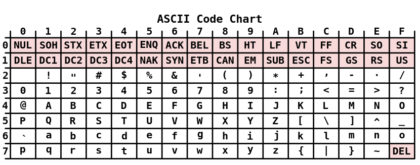

## char

Напомню, что в прошлой лекции мы говорили в том числе и о целочисленных переменных. В этот раз мы остановимся более детально на типе ```char```. Он выделяется из обычных целочисленных типов (таких как ```short```, ```int``` и ```long long```). Например, если мы напишем в программе:

```c++
char c = 65;
cout << c;
```

то внезапно увидим не 65, а единственный символ - заглавную латинскую букву ```A```.

Это происходит, потому что при выводе переменной типа ```char``` С++ считает, что мы хотим вывести символ (англ. char). Осталось ответить на главный вопрос:

> А почему выводится именно ```A```?

### ASCII table

В далёком 1963 году люди решили стандартизировать таблицу между символами и числами. Этот стандарт они назвали ASKII-таблицей, и ниже вы можете увидеть таблицу, преобразующую числа от 0 до 127 в сиволы.



1. Нумерация колонок здесь в 16-ричной системе счисления. То есть, если вы смотртие на яцейку в строке i, столбце j, то её номер - i*16+j. Например, в 4-й строке 1-м столбце (4 * 16 + 1 = 65 клетке) находится та самая буква ```A```.
2. Символы с 0 по 31 являюся служебными
3. Символы с 32 по 127 можно спокойно печатать и не бояться за жизнь

Безусловно, вам не надо запоминать ACKII-таблицу. Если вам интересен, какой порядковый номер имеет тот или иной символ, то вы можете запустить простейший код:

```c++
int c = 'z';
cout << z;
```

На самом деле при вниметельном рассмотрении таблицы должен возникнуть очередной вопрос:

> А как же хранятся русские символы?

При более внимательном рассмотрении возниакет ещё одна мысль. Вы могли заметить, что мы использовали "не весь потанцеал" типа ```char```. А именно, тип 8-битный, то есть в нем можно хранить числа от 0 до 255, а таблицу мы заполнили только до 127.

> Кто украл вторую половину таблицы, Билли?

Эти два вопроса связаны.

### Вторая половина ASKII-таблицы

Вторую часть таблицы было принято отдать "на outsource". В разных страных разные буквы, поэтому вторая часть таблицы зависит от раскладки вашей клавиатуры. Более того, даже если вы в России, то существут разные вторые части таблицы, такие как CP1251, KOI8-R и другие, они называются кодировка.

CP1251 выглядит так:


KOI8-R выглядит так:


На самом деле это сущий кошмар, и в жизни вы ни раз столкнетесь с проблемой кодикровки. Однако, в мире спортивного программирования все сиволы находятся в интервале от 32 до 127, а значит никаких проблем не будет.

Дотошный читатель заметит ещё две пробемы:

> В некоторых языках (например, китайских иероглифах) символов больше чем 128, как люди живут?

> Неужели, мне надо менять кодировку каждый раз, когда я хочу напечатать сивол из третьего языка?

Обе проблемы решает универсальная кодирока, именуемая [Unicode](https://ru.wikipedia.org/wiki/%D0%AE%D0%BD%D0%B8%D0%BA%D0%BE%D0%B4) и её модификации: UTF-8, UTF-16, UTF-32 (в зависиомти от количества бит на символ). Об этом я рассказывать не буду, но вы можете прочитать Википедию или посмотреть какое-нибудь видео на YouTube.

## String

Отлично, со строками разобрались! Теперь разбираемся с полседовательностью сиволов, или строками.

Есть два ~~стула~~ способа представления строк. Первый, более очевидный, - это хранить строку в виде массива элементов типа ```char```. Например, так:

```cpp
char str[10] = { 'a', 'b', 'c' }; // Это называется список инициализации
char str[10] = "abc"; // Но можно и без него
```

К сожалению, данный подход обладает большим количеством недостатков, о которых мы обязательно поговорим, когда дойдём до итераторов.

Другой способ - это тип ```string```. Он удобен тем, что для него есть множество методов, помогающих работать со строками:

```cpp
string s = "abcd";
cout << s.substr(1, 2) << '\n'; // подстрока с 1 позиции, 2 последующих символа - "bc"
cout << s[3] << '\n'; // 'd'
cout << s.size() << '\n'; // 4
string t = "gg";
cout << t + s; // "abcdgg"
cout << (t < s); // сравнение строк лексикографически, результат - false, выведется 0
```

## Решаем пару задач

### [D контеста](http://codeforces.com/gym/344773/problem/D)

Не сложно заметить, что максимальный суммарный балл будет достигнут в случае, когда правильный ответ на вопрос номер k дало больше всего студентов. Таким образом, для каждого вопроса надо найти максмиальное количество студентов, которое ответило одинаково.

```cpp
#include <iostream>
#include <string>
#include <vector>

using namespace std;

int main() {
    int n, m;
    cin >> n >> m;
    
    vector<vector<int>> count(m, vector<int>(5)); // массив размера M x 5, заполнен изначально нулями
    for (int i = 0; i < n; ++i) { // читаем все строки
        string s;
        cin >> s;
        for (int j = 0; j < m; ++j) {
            count[j][s[j] - 'A']++; // заполняем количество встречаемости ответа s[j] на вопрос j
        }
    }

    vector<int> a(m);
    for (int i = 0; i < m; ++i) { // читаем a
        cin >> a[i];
    }

    int ans = 0;
    for (int i = 0; i < m; ++i) { // перебираем вопросы
        int mx = 0;
        for (int j = 0; j < 5; ++j) { // ищем максимальную встречаемость на вопрос номер i
            if (count[i][j] > mx)
                mx = count[i][j];
        }
        ans += mx * a[i]; // добавляем максимум к ответу
    }
    cout << ans;
}
```

### [H контеста](http://codeforces.com/gym/344773/problem/H)

Данная задача исключительно на работу со строками. Можно пользоваться substr, можно вспомнить о find и rfind. Остановимся на первом варианте:

```cpp
#include <iostream>
#include <string>
#include <vector>

using namespace std;

int main() {
    string s;
    cin >> s;

    bool has_elier_name = false;
    int n = s.size();

    vector<string> friends = { "Danil", "Olya", "Slava", "Ann", "Nikita" }; // Да, у вектора тоже есть список инициализации

    for (int i = 0; i < n; ++i) {
        for (int j = 0; j < friends.size(); ++j) {
            if (s.substr(i, friends[j].size()) == friends[j]) { // если подстрока равна j-му имени
                if (has_elier_name) { // это не первое вхождение
                    cout << "NO";
                    return 0; // завершить программу (работает только внутри main)
                }
                else {
                    has_elier_name = true;
                }
            }
        }
    }

    if (has_elier_name)
        cout << "YES";
    else
        cout << "NO";
}
```

# Функции

## Что это такое?

До этого момента мы с вами писали весь код внутри main. Настал тот момент, когда мы напишем свою первую функцию. Любая функция характеризуется несколькими вещами:

1. Входные аргументы функции
2. Выходное значение функции
3. Что, собственно, делает функция

Синтаксис и примеры:

```cpp
<output_type> function_name(<input_args>) {
    // тело функции
}

int count_bits(int x) { // функция возвращает одно число типа int и принимает одно число типа int
    int count = 0;
    while (x > 0) { // убираем по одному биту
        x = x & (x - 1);
        ++count;
    }
    return count; // возвращаем результат
}

bool has_name(string s, int pos, string t) { // возвращает bool, принимает 3 аргумента: строку s, позицию pos и строку t
    // возвращает true, если s, начиная с позции pos строка равна t
    return s.substr(pos, t.size()) == t;
}
```

Однако, в момент написания последнего примера вы должны остановиться и надавать себе по рукам. Что же мы не так сделали?

## Передача аргументов по ссылке и по значению

Если вы пишете функцию и где-то её вызываете:

```cpp
bool has_name(string s, int pos, string t) {
    return s.substr(pos, t.size()) == t;
}

int main() {
    cout << has_name("abc", 1, "bc");
}
```

то вы должны осознавать, что в функцию будет передана КОПИЯ строки s, КОПИЯ строки t и КОПИЯ переменной pos. Это сделано для того, чтобы вы могли внутри функции менять данные переменные как хотите. 

```cpp
void func(string s) { // void - когда функция ничего не возвращает
    s = "haha classic";
}

int main() {
    string s = "abc";
    func(s);
    cout << s; // abc
}
```

Однако, в данный момент стоит задуматься о времени работы программы. кпоирование строки происходит абсолютно в лоб, то есть за длину строки. Таким образом, если вы вызовите 1000 раз данную функцию для строк длины порядка 1000, то потребуется 1000*1000 операций.

**Решение:** передавать некоторые аргументы по ссылке. При передачи поссылке объект не копируется. При этом если вы поменяете объект внутри функции, то и вне функции он тоже изменится. Синтаксис следующий:

```cpp
void func(string& s) {
    s = "haha classic";
}

int main() {
    string s = "abc";
    func(s);
    cout << s; // haha classic
}
```

## Зачем нужны функции?

1. Чтобы увличивать читабельность кода (следовательно, и отладку тоже)
2. Чтобы не копипастить одни и те же куски кода (и меньше багать таким образом)
