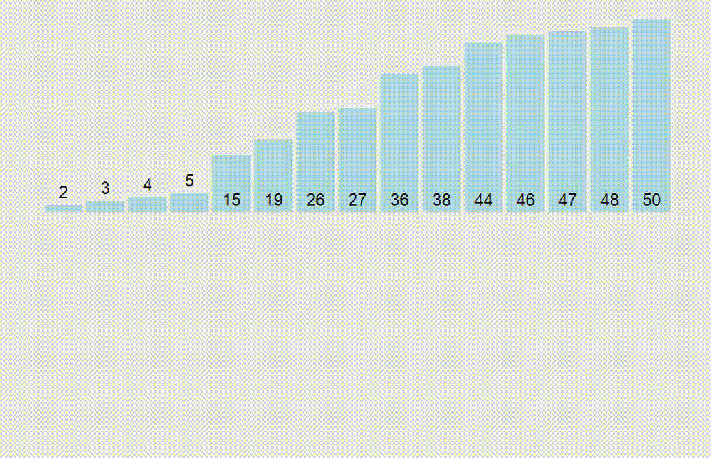
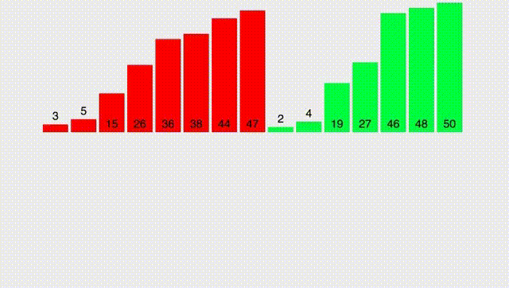
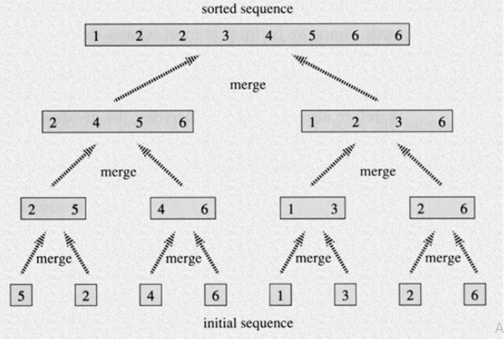
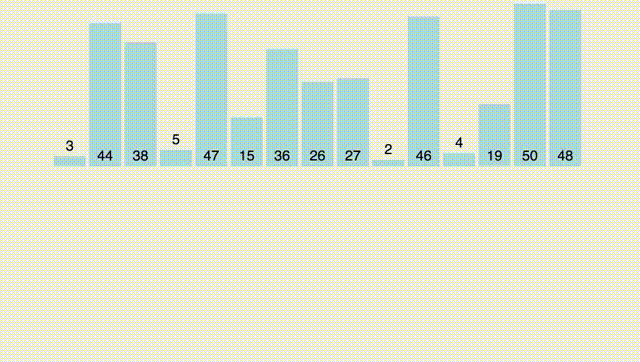

## Сортировка вставкой [Insert sort]

Это одна из самых простых сортировок, которые можно придумать. Разберём сортировку на примере: пусть дан массив [2, 1, 10, 5]. Отсортируем его за 4 шага, для этого на каждом шаге будем смотреть лишь на первые несколько элементов массива. На первом шаге - только на первый, на втором - только на первый и второй и т.д.

* [2] - отсортированный массив
* к массиву [2] добавляется 1, после сортировки становится [1, 2]
* к массиву [1, 2] добавляется 10, после сортировки становится [1, 2, 10]
* к массиву [1, 2, 10] добавляется 5. После сортировки становится [1, 2, 5, 10]

Теперь должно стать понятно, почему сортировка называется "сортировка вставкой". На каждой итерации, чтобы отсортировать массив, нам необходимо лишь вставить его в нужное место. Например, на последней итерации мы вставили 5 между 2 и 10, чтобы массив вновь стал отсортированным.

Реализуем эту сортировку на C++:

```cpp
void sort(vector<int>& a) {
    for (int i = 1; i < a.size(); ++i) { // цикл по всем итерациям; первую можно пропустить
        for (int j = i; j > 0 && a[j] < a[j - 1]; --j) { // вставляем a[i] на нужную позицию
            swap(a[j], a[j - 1]);
        }
    }
    return a;
}
```

Прокомментирую внутренний цикл. Он сдвигает элемент, если он идёт "не в правильном порядке". Например, у нас массив из [1, 5, 10, 4] и сейчас мы должны вставить 4 на нужную позицию, тогда будем постепенно её сдвигать влево, пока не окажется ситуации 1 < 4 < 5.

Добавим сюда визуализацию:



К сожалению, наша сортировка работает за O(n<sup>2</sup>). Сегодня мы рассмотрим более крутые сортировки!

## Пузырьковая сортировка [Bubble sort]

Это вторая наша сортировка, и она тоже будет работать за O(n<sup>2</sup>). Однако, оказалось, что на практике она ведёт себя весьма неплохо (но, конечно, не применима в олимпиадном программировании).

Мы опять будем сортировать массив "потихоньку". И на самом деле вы увидите гигантское сходство с сортировкой вставкой. На каждой итерации мы опять будем требовать, чтобы был отсортирован некоторый префикс нашего массива, но теперь мы сделаем трюк: если мы видим, что пара элементов стоят не в правильном порядке (то есть a[j - 1] > a[j]), то поменяем их местами и будем делать так НА ВСЁМ массиве. То есть от сортировки вставкой есть лишь одно отличие: на каждой итерации мы проходимся по всему массиву.

```cpp
void sort(vector<int>& a) {
    for (int i = 1; i < a.size(); ++i) {
        for (int j = n - 1; j > 0; --j) {
            if (a[j] < a[j - 1])
                swap(a[j], a[j - 1]);
        }
    }
}
```

На практике (если такая фраза применима к сортировкам) люди обрывают итерации как только внутренний цикл не сделал ни одного swap.

Добавим визуализацию работы пузырьковой сортировки (здесь всё работает в другом порядке: вместо того, чтобы проталкивать минимум, как в реализации выше, проталкивается максимум).


Если хотите посмотреть, как работает пузырьковая сортировка на примере танца (вдруг), то [Bubble-sort with Hungarian](https://youtu.be/lyZQPjUT5B48) вам поможет.

## Сортировка слиянием [Merge sort]

А вот и золото нашей сегодняшней программы - сортировка слиянием. Позволяет сортировать массив за O(n log n). К тому же, сортировка очень простая и легко интерпретируемая (в отличии от быстрой сортировки из следующего раздела).

### Merge

Для начала разберем простой вспомогательный алгоритм, который назовём merge. Он принимает два ОТСОРТИРОВАННЫХ массива и выдает отсортированный массив, состоящий из всех элементов обоих массивов. При этом, делает это крайне быстро. Работу функции лучше всего описать гифкой:



Прокомментирую: нам необходимо поддерживать два указателя (указатель на текущий элемент в первом массиве и во втором). Далее, сравнивать два текущих элемента и выписывать меньший из них. После - нужно сдвинуть указатель.

```cpp
vector<int> merge(const vector<int>& a, const vector<int>& b) {
    int n = a.size(), m = b.size();
    vector<int> res(n + m);
    for (int i = 0, j = 0; i < n && j < m; ) {
        if (i < n && j < m && a[i] < b[j] || j == m) {
            res[i + j] = a[i];
            ++i;
        } else {
            res[i + j] = b[j];
            ++j;
        }
    }
    return c;
}
```

Небольшой комментарий: конечно же, мы должны сравнивать a[i] и b[j] только в том случае, когда мы не вышли за границы массива. А если вышли за границы одного из них, то нужно выписывать элементы из другого массива (для этого проверяется j == m).

### Merge sort

Теперь воспользуемся техникой Divide and Conqueror. Что же мы будем разделять и как нам над этим властвовать?

* Divide. Разделим массив на две равные части. Отсортируем каждую из частей по-отдельности рекурсивно
* Conqueror. Теперь, когда каждая из частей массива отсортированная, мы можем их склеить с помощью функции merge.

Картинка для наглядности и оценки времени алгоритма:



Напишем код и воспользуемся встроенной функцией merge:

```cpp
void sort(vector<int>& a, int l, int r) { // сортируем интервал [l; r)
    if (r - l == 1) {
        return; // массив из одного элемента отсортирован
    } else {
        int m = (r + l) / 2;
        sort(a, l, m);
        sort(a, m, r);
        vector<int> res(r - l);
        merge(a.begin() + l, a.begin() + m, a.begin() + m, a.begin() + r, res.begin());
        copy(res.begin(), res.end(), a.begin() + l);
    }
}
```

В очередной раз прокомментирую реализацию: встроенная функция merge принимает итераторы на начало и конец первого массива, итераторы на начало и конец второго массива и итератор на начало места, куда положить результата merge.

**Очень важно.** Вы не можете класть результат сразу в a.begin() + l. В этом случае вы можете затереть значения левого массива! Поэтому я создаю временный массив и только потом из него копирую элементы в исходный.

И последнее, можно заметить, что сортировка делает O(n log n) операций сравнения, потому что всего есть log n уровней (смотри картинку выше), суммарное время работы сортировки на каждом уровне - O(n). Значит сортировка работает за O(n log n).

Добавим сюда визуализацию кода, написанного выше:



### Количество инверсий

> Инверсией в массиве называется пара (i, j), для которых верно, что i <  j и a[i] > a[j]. Посчитайте количество инверсий за O(n log n).

## Быстрая сортировка [Quick sort]

Быстрая сортировка очень похожа на merge sort, но в ней есть одно ключевое отличие: она недетерминированная, то есть в ней присутствует элемент случайности.

Сортировка будет состоять из нескольких итераций:

1. Выбор опорного элемента (pivot) - он производится случайно.
1. Вызываем функцию partition, которая сортирует всё относительно опорного элемента. То есть все элементы, меньшие pivot, оказываются левее него, а большие - правее.
1. Рекурсивно запускаем сортировку для левой и правой частей массива.

Функция partition будет проходиться по массиву ровно один раз с помощью двух указателей - левый и правый, которые изначально стоят в самом левом и самом правом элементе массива. Если так оказывается, что левый элемент больше pivot, а правый - меньше, то меняем их местами. Иначе двигаем один из указателей (тот, который ок, то есть если левый элемент меньше pivot, то он ок и двигаем его, аналогично с правым).

Добавим сюда визуализацию:


Если хотите посмотреть, как работает быстрая сортировка на примере танца (вдруг), то [Quick-sort with Hungarian](https://youtu.be/ywWBy6J5gz8) вам поможет.

Реализация приняла Ислам.

## Сортировка подсчётом [Counting sort]

Одна из самых простых, но в то же время полезных сортировок. И её алгоритм настолько прост, на сколько это только возможно.

1. Посчитаем количество каждого элемента в массиве
2. Выпишем элементы в порядке возрастания в нужном количестве

Такая сортировка работает только для целых чисел и работает быстро, если по условию максимальное число в массиве (обозначим его за C) не очень большое (сопоставимо с количеством элементов в массиве). В таком случае сортировка будет работать за O(n + C).

Реализация так же проста до безобразия:

```cpp
void sort(vector<int>& a) {
    vector<int> cnt(1'000'000);
    for (int x : a) {
        cnt[x]++;
    }
    int ptr = 0;
    for (int c : cnt) { // пробегаемся по всем возможным значениям
        while (c--) { // выписываем их c раз
            a[ptr++] = c;
        }
    }
}
```

## По цифрам [Radix sort]

Скорее всего, когда вы услышали словосочетание "сортировка по цифрам", то подумали, что мы будем сортировать числа сначала по первому разряду, затем по второму, затем по третьему и т.д. То есть это то, как вы сортируете у себя в голове. Такой подход называется MSD-сортировка (Most Significant Digit radix sort), и оказывается, что он не лучший по асимптотике и по удобству реализации.

Более удобный и быстрый подход называется LSD-сортировкой (Least Significant Digit radix sort), и, как видно по названию, мы будем сортировать числа от младшего разряда к старшему.

Для лучшей интерпретируемости алгоритма будем говорить, что на k-той итерации все числа состоят лишь из последних k разрядов (более старшие мысленно откинем). Тогда мы хотим, чтобы к концу k-той итерации k последних разрядов были отсортированы.

Для этого нам нужно придумать переход: пусть отсортированы k-1 разряд и сейчас к каждому числу дописывается ещё один разряд в начало (k-тый). Как отсортировать массив?

В отсортированном массиве сначала будут идти числа, начинающиеся на 0, затем на 1, затем на 2 и т.д. Тогда посчитаем, сколько у нас сейчас чисел, начинающихся на 0, 1, и т.д. до 9. За счет их количества, мы знаем, начиная с какой позиции в отсортированном массиве будут идти числа, начинающиеся на 0, 1, ... 9.

А теперь пройдемся по массиву, отсортированному по k-1 разряду, выписывая их в "нужный блок" - ту группу чисел, которая начинается с соответствующей первой цифрой. И в итоге нас получится отсортированный массив уже по k разрядам.


Такая сортировка работает за O(n log<sub>10</sub> C), так как у нас есть log<sub>10</sub> C итераций - длина числа и на каждой итерации мы проходимся по всему массиву.

В этот момент стоит задуматься: а почему в основании логарифма 10? Потому что система счисления у нас с вами десятичная. Ну ладно, давайте тогда переведём числа в B-ричнную систему счисления, где B=2<sup>16</sup>! Тогда мы отсортируем массив за O((n + B)log<sub>B</sub> C), что в случае чисел до 10<sup>9</sup> будет обозначать 2 итерации. **ВАУ!**

Код будет весьма тяжелым, значительно тяжелее всех прошлых подходов, но сортировать целые числа до 10<sup>9</sup> за 2 прохода того стоит:

```cpp
void RadixSort(vector<uint32_t> &arr) {
    size_t size = arr.size();
    vector<uint32_t> tmp(size);
    const uint32_t BUCKET_SIZE = 1 << 16;
    vector<uint32_t> ptr(BUCKET_SIZE);

    const uint32_t MASK = (1 << 16) - 1;

    // первая итерация
    for (size_t i = 0; i < size; ++i) {
        ++ptr[arr[i] & MASK]; // считем количество чисел в каждом блоке
    }
    partial_sum(ptr.begin(), ptr.end(), ptr.begin()); // считем позиции, начиная с которых будут идти блоки
    for (int i = BUCKET_SIZE - 1; i > 0; --i) {
        ptr[i] = ptr[i - 1];
    }
    ptr[0] = 0;
    for (size_t i = 0; i < size; ++i) { // заполняем блоки
        tmp[ptr[arr[i] & MASK]++] = arr[i];
    }
    tmp.swap(arr);

    fill(ptr.begin(), ptr.end(), 0);

    // вторая итерация
    for (size_t i = 0; i < size; ++i) {
        ++ptr[arr[i] >> 16];
    }
    partial_sum(ptr.begin(), ptr.end(), ptr.begin());
    for (int i = BUCKET_SIZE - 1; i > 0; --i) {
        ptr[i] = ptr[i - 1];
    }
    ptr[0] = 0;
    for (size_t i = 0; i < size; ++i) {
        tmp[ptr[arr[i] >> 16]++] = arr[i];
    }
    arr.swap(tmp);
}
```
