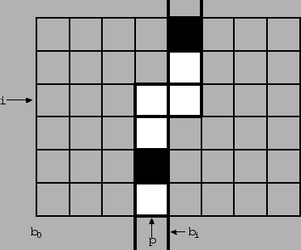

## Задача коммивояжера

> Во взвешенном графе необходимо проложить маршрут кратчайшей длины, посещающий все вершины, при том каждую только один раз.

<details markdown="1"><summary>Решение</summary>

Пусть dp[mask][v] - это кратчайший путь, посещающий все вершины из $mask$ и заканчивающийся в вершине $v$. Mask (маска) - это последовательность из $n$ нулей и единиц. Здесь и далее мы будем говорить, что вершина лежит в маске, если на её позиции стоит единица.

Переходы в динамике вполне очевидны: $dp[mask][v] \to dp[mask + u-тая вершина][u] + adj[v][u]$, где $adj[v][u]$ - вес ребра между вершинами $v$ и $y$. Или, на C++, так:

```cpp
new_mask = mask | (1 << u);
dp[new_mask][u] = min(dp[new_mask][u], dp[mask][v] + adj[v][u])
```

Таким образом мы найдем ответ за время O(2^n \cdot n^2), так как в динамике $2^{n}\cdot n$ состояний и из каждого $n$ переходов.
</details>

<details markdown="1"><summary>Код</summary>

```cpp
#include <iostream>
#include <vector>
#include <algorithm>
#include <fstream>
#include <random>
#include <queue>
#include <cstring>

using namespace std;

const int N = 19;
int a[N][N];
int dp[(1 << N)][N];
const int INF = 2e9;

signed main() {
    cin.tie(0);
    ios_base::sync_with_stdio(0);

    int n;
    cin >> n;

    for (int i = 0; i < n; ++i) {
        for (int j = 0; j < n; ++j) {
            cin >> a[i][j];
        }
    }

    int P = 1 << n;

    for (int mask = 0; mask < P; ++mask) {
        for (int i = 0; i < n; ++i) {
            dp[mask][i] = INF;
        }
    }
    for (int i = 0; i < n; ++i) {
        dp[1 << i][i] = 0;
    }

    for (int mask = 0; mask < P; ++mask) {
        for (int i = 0; i < n; ++i) { // последняя вершина в пути
            for (int j = 0; j < n; ++j) {
                if (((mask >> i) & 1) && ((mask >> j) & 1) == 0) {
                    dp[mask | (1 << j)][j] = min(dp[mask | (1 << j)][j], dp[mask][i] + a[i][j]);
                }
            }
        }
    }

    int best_end = 0;
    for (int i = 0; i < n; ++i) {
        if (dp[P - 1][i] < dp[P - 1][best_end]) {
            best_end = i;
        }
    }

    cout << dp[P - 1][best_end] << '\n';
    vector<int> ans;
    int mask = P - 1;
    for (int i = 0; i < n; ++i) {
        ans.push_back(best_end);
        int old_mask = mask ^ (1 << best_end);
        for (int j = 0; j < n; ++j) {
            if (dp[old_mask][j] + a[j][best_end] == dp[mask][best_end]) {
                best_end = j;
                break;
            }
        }
        mask = old_mask;
    }
    for (int i = n - 1; i >= 0; --i) {
        cout << ans[i] + 1 << ' ';
    }
}
```

</details>

## Симпатичные узоры-2

> Нужно найти количество способов замостить поле $n \times m$ ($nm \leq 200$) чёрными или белыми клеточками $1 \times 1$ так, чтобы не было поля $2\times 2$ из одного цвета.

<details markdown="1"><summary>Решение</summary>

Из ограничений следует, что $\min(n, m) \leq 14$. Пусть без ограничения общности $n \leq 14$.

Мы будем считать количество способов замостить поле "по слоям" из $m$, или иначе говоря по "профилям", то есть сначала для $m=1$, затем для $m=2$ и т.д. Конечно же, мы можем в лоб прикладывать один профиль к другому, проверяя нет ли в них одноцветного квадрата $2\times 2$, но это долго, ведь различных профилей $2^{14}$ (каждый цвет $0$ или $1$), а нам нужно квадрат количества профилей переходов, то есть $2^{28}$.

Чтобы эффективно считать такую ДП, внутри профиля мы будем поддерживать "излом" - это место, где профиль изгибается:



Такое состояние будет кодироваться парой $(mask, i)=(33, 2)$ где $i$ - место, где профиль изломался. Ну и, очевидно, что мы будем увеличивать $i$ внутри одного профиля так, чтобы к в конце у нас получился полноценный профиль без излома.

Вернёмся к задаче. Мы хотим уметь делать все переходы из состояния $(mask, i)$. Для этого нужно покрасить в какой-то цвет клетку,где ломается профиль. Но мы должны соблюсти условие, что не должно быть одноцветного квадрата $2 \times 2$. К сожалению, для этого придется ввести ещё одну размерность $c \in [0;1]$ - цвет клетки по диагонали от излома. Теперь информации достаточно, чтобы понимать, в какие цвета можно красить клетку на изломе профиля.

Например, мы можем покрасить клетку на изломе в цвет 0, если $c = 1$ или в $mask$ на позиции $i$ или $i-1$ стоит $1$. Аналогично с цветом $0$.

Так же при написании ДП по изломанному профилю стоит обратить внимание на переходы от одного профиля к другому, они становятся не такими тривиальными. Более подробно - см. реализацию.
</details>

<details markdown="1"><summary>Код</summary>

```cpp
#include <iostream>
#include <vector>
#include <cassert>
#include <set>
#include <cstring>

using namespace std;

// dp[mask][c][i]
const int N = 14;
int dp[1 << N][2][N + 1], newdp[1 << N][2][N + 1];
const int MOD = (1 << 30) + 1;

int main() {
    int n, m;
    cin >> n >> m;
    if (n > m) {
        swap(n, m);
    }
    // n <= m

    if (m == 1) { // n = m = 1
        cout << 2;
        return 0;
    }

    int p = 1 << n;
    for (int mask = 0; mask < p; ++mask) {
        for (int c = 0; c < 2; ++c) {
            dp[mask][c][1] = 1;
        }
    }

    for (int layer = 1; layer < m; ++layer) {
        for (int i = 1; i < n; ++i) {
            for (int mask = 0; mask < p; ++mask) {
                for (int c = 0; c < 2; ++c) {
                    if (((mask >> i) & 1) || ((mask >> (i - 1)) & 1) || c) {
                        dp[mask & ~(1 << i)][(mask >> i) & 1][i + 1] = (dp[mask & ~(1 << i)][(mask >> i) & 1][i + 1] + dp[mask][c][i]) % MOD;
                    }
                    if (((mask >> i) & 1) == 0 || ((mask >> (i - 1)) & 1) == 0 || c == 0) {
                        dp[mask | (1 << i)][(mask >> i) & 1][i + 1] = (dp[mask | (1 << i)][(mask >> i) & 1][i + 1] + dp[mask][c][i]) % MOD;
                    }
                }
            }
        }

        if (layer == m - 1) {
            int ans = 0;
            for (int c = 0; c < 2; ++c) {
                for (int mask = 0; mask < p; ++mask) {
                    ans = (ans + dp[mask][c][n]) % MOD;
                }
            }
            cout << ans;
            return 0;
        }

        memset(newdp, 0, sizeof newdp);
        for (int c = 0; c < 2; ++c) {
            for (int mask = 0; mask < p; ++mask) {
                newdp[mask & ~(1)][mask & 1][1] = (newdp[mask & ~(1)][mask & 1][1] + dp[mask][c][n]) % MOD;
                newdp[mask | 1][mask & 1][1] = (newdp[mask | 1][mask & 1][1] + dp[mask][c][n]) % MOD;
            }
        }
        memcpy(dp, newdp, sizeof newdp);
    }
}
```

</details>

## Ссылки

1. [Большой пост с разбором восьми задач на ДП по подмножествам с кучей трюков](https://codeforces.com/blog/entry/337)
1. [English SOS dp tutorial с задачами на тему](https://codeforces.com/blog/entry/45223)
1. [Перебор всех подмасок данной маски](http://e-maxx.ru/algo/all_submasks)
